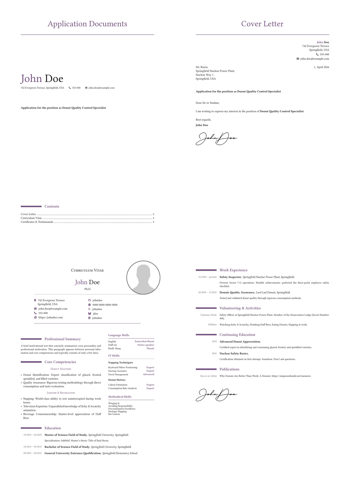

# Application Documents Template

A Typst template for generating complete job application packages with cover letters, CVs, and supporting documents. 
Data-driven from YAML, fully customizable styling.



## Features

- **Data-Driven**: All content is separated from layout
- **Complete Application Package**: Cover page, cover letter, CV (multi-column + sidebar), and certificates cover page
- **Flexible Styling**: Customize colors, fonts, spacing via YAML settings
- **Markdown Support**: Write letter bodies with support for Markdown formatting and paragraph spacing
- **Multi-language Ready**: Translation strings via `src/translate.yml`

## Quick Start

### 1. Install Typst

See https://typst.app/ for details.

### 2. Customize Your Data

The template uses a language-based configuration approach:

**Configuration Files:**
- `config.yml`: Settings (language, colors, fonts), table of contents, and certificates list
- `cv-data.{lang}.yml`: Language-specific CV content and personal details (e.g., `cv-data.en.yml`, `cv-data.de.yml`)

Edit `config.yml` with your styling preferences:
- Language setting (controls which CV data file is loaded)
- Theme colors and fonts

Edit the `personal:` section in your `cv-data.{lang}.yml` file (e.g., `cv-data.en.yml` for English, `cv-data.de.yml` for German)  with your contact details, photo, and social profiles. 
Then add your CV sections: Education, work experience, skills, languages, etc.

To change the language, simply update the `lang` setting in `config.yml` and the appropriate language-specific CV file will be loaded automatically.

> [!Important]
> Your root directory must contain:
> - `config.yml` (required) 
> - At least one `cv-data.{lang}.yml` file matching your chosen language (must include a `personal:` section)
> 
> The `photo.png` and `signature.png` are optional. If you choose not to include them, remove the corresponding entries from `cv-data.{lang}.yml` to avoid compilation errors.
>
> **Note on file paths:** Paths starting with `/` (e.g., `/photo.png`, `/signature.png`) refer to the project's root directory.

### 3. Write your Cover Letter

Edit `cover-letter.md` to customize the cover letter for each application. The file uses YAML frontmatter for metadata and Markdown for the letter body:

```markdown
---
position: Your Target Job Title
date: Today's Date
recipient:
  contact: Hiring Manager Name
  company: Company Name
  street: Street Address
  city: City, Country
---

Dear Sir or Madam,

Letter content here with **bold**, *italic*, and other Markdown formatting.

Best regards,
```

The YAML frontmatter contains all application-specific information, while the Markdown body supports full formatting. You don't need to edit any `.typ` files—just this one Markdown file per application!

Of course, you can also just compile the CV without a cover letter.

### 4. Compile

```bash
# Full application package
typst compile --root . layouts/application-documents.typ full-application.pdf

# Just the CV
typst compile --root . layouts/cv.typ cv.pdf

# Just the cover letter
typst compile --root . layouts/cover-letter.typ cover-letter.pdf

# Publications list (requires citations.bib in project root)
typst compile --root . layouts/publications.typ publications.pdf
```

> [!Tip]
> If you have justfile installed, you can also use shortcuts for these commands. 
> Simply run `just` in your terminal to see the available commands.
>
> All targets accept an optional `mode` argument to switch between compile and watch mode:
> ```bash
> just cv            # compile once (default)
> just cv watch      # watch mode — recompile on every save
> just publications  # compile the publications list
> ```

> [!Note]
> Typst cannot track page numbers automatically. If your content shifts pages, update the `toc` entries in `config.yml` with the correct page numbers.

## Project Structure

```
├── README.md                      # This file
├── typst.toml                     # Package metadata
├── config.yml                     # Settings, TOC & certificates (YAML)
├── cv-data.en.yml                 # English CV content + personal data (YAML)
├── cv-data.de.yml                 # German CV content + personal data (YAML)
├── citations.bib                  # BibTeX file for publications (optional)
├── photo.png                      # Your photo (optional)
├── signature.png                  # Your signature (optional)
├── src/
│   ├── application_docs.typ       # Main template functions
│   ├── rendering.typ              # CV section renderers
│   └── translate.yml              # Multi-language strings
└── layouts/
    ├── application-documents.typ  # Full package entry point
    ├── cover-letter.typ           # Letter-only entry point
    ├── cv.typ                     # CV-only entry point
    └── publications.typ           # Publications list entry point
```

## Customization

### Colors, Fonts & Language

Edit the `settings:` block in `config.yml`:

```yaml
settings:
  lang:   en                        # Language: 'en', 'de', etc.
  accent: rgb("#435476")            # Primary color (headers, emphasis)
  text:   rgb("#1c1c1c")            # Body text color
  meta:   rgb("#666666")            # Secondary text (dates, labels)
  font:   "Libertinus Serif"
  size:   10pt
```

Changing the `lang` setting automatically loads the corresponding `cv-data.{lang}.yml` file.

### Personal Information

Edit the `personal:` block in your `cv-data.{lang}.yml` file:

```yaml
personal:
  first-name: John
  last-name: Doe
  address-street: "Street Address"
  address-city: "City, Country"
  phone: "+1 (555) 000-0000"
  email: john@example.com
  website: https://example.com
  photo: /photo.png
  signature: /signature.png
  titles: [Ph.D.]
  profiles:
    - network: GitHub
      url: https://github.com/johndoe
```

### Table of Contents & Certificates

Configure the cover page table of contents and the certificates list in `config.yml`:

```yaml
toc:
  - ["Cover Letter", 2]
  - ["Curriculum Vitae", 3]
  - ["Certificates & Testimonials", 5]

certificates:
  - High School Diploma
  - University Certificates
  - Driver's Licenses
```

Each `toc` entry is a `[title, page]` pair. Update the page numbers manually whenever content shifts pages.

### CV Sections

The order of sections in the rendered CV follows the key order in `cv-data.{lang}.yml` — reorder them there to change their order in the PDF.

Create language-specific CV data files like `cv-data.en.yml` with these sections:

```yaml
cv:
  motivation: "Professional summary paragraph"
  core-competencies:
    - title: "Category"
      items:
        - "Competency description"
  education:
    - date: "10/2020 – 06/2024"
      title: "Degree Name"
      institution: "University"
      location: "City"
      description: "Additional notes"
  work-experience:
    - date: "01/2024 – present"
      title: "Job Title"
      employer: "Company"
      location: "City"
      description: "Duties and achievements"
  sidebar:
    languages:
      - name: "Language"
        level: "Proficiency"
    it-skills:
      - category: "Category"
        items:
          - name: "Skill"
            level: "Expert"
    methods:
      - "Method or skill"
  volunteering:
    - label: "Activity Type"
      text: "Description"
  continuing-education:
    - date: 2024
      title: "Course/Certificate"
      description: "Brief description"
  publications:
    - label: "Label"
      title: "Publication Title"
      url: "https://example.com"
```

For more examples of how to structure the CV sections, see `cv-data.en.yml` or `cv-data.de.yml`.

### Publications

To include a publications list, add a `citations.bib` file to your project root and compile `layouts/publications.typ`:

```bash
typst compile --root . layouts/publications.typ publications.pdf
# or
just publications
```

Publications are automatically grouped into sections by BibTeX entry type:

| Section | Entry types |
|---|---|
| Journal Articles | `article` |
| Conference Contributions | `inproceedings`, `proceedings`, `conference` |
| Technical Reports & Other | `techreport`, `report` |
| Theses | `phdthesis`, `mastersthesis`, `thesis` |

Sections with no matching entries are omitted automatically. The author whose family name matches `personal.last-name` in your CV data is highlighted in bold.

### Skipping CV Sections

Prefix any key in `cv-data.{lang}.yml` with `_` to hide that section without deleting it:

```yaml
cv:
  _volunteering:   # hidden — will not appear in the rendered CV
    - label: "..."
  education:
    - ...
```

### Adding More Languages

To support additional languages:

1. Create a new language-specific CV data file: `cv-data.{lang}.yml` (e.g., `cv-data.fr.yml` for French)
2. Update the `lang` setting in `config.yml` to your desired language code
3. Ensure `src/translate.yml` contains translations for your language

When you compile with the updated language setting, the template will automatically load the corresponding CV data file.


## Tips

- The best way to keep your personal CV data private: use this repository as a submodule in a private repository. Create all your personal YAML, BibTeX and PNG files in the root of the private repository and compile from there. Note that you need to point to the layouts in the submodule.
- Alternatively, keep `config.yml`, `photo.png`, `signature.png`, and your `cv-data.{lang}.yml` files private (add to `.gitignore`)
- Use your main branch or a dedicated full-cv branch to populate your CV over time
- For different job applications, use separate branches 

  <details>
  <summary>Example: Branching workflow</summary>

  For job applications, create a branch per application:

  ```bash
  git checkout -b application/company-name
  # Edit your cv-data.{lang}.yml file
  typst compile --root . layouts/application-documents.typ "Application_CompanyName.pdf"
  git add -A && git commit -m "Application: Company Name"
  git tag application/company-name
  ```

  This keeps the main branch clean while maintaining a history of all applications. (In the git log you will also have the creation dates of your applications.)
  </details>


## Requirements

- [Typst](https://typst.app/) ≥ 0.14.2
- `@preview/fontawesome:0.6.0` (automatically downloaded)
- `@preview/pergamon:0.8.0` (automatically downloaded, used for publications)
- `@preview/citegeist:0.2.2` (automatically downloaded, used for publications)

## License

MIT

## Credits

Built with [Typst](https://typst.app/) and [FontAwesome](https://fontawesome.com/). \
Thanks to rajgeophysik for inspiration on design and layout.
